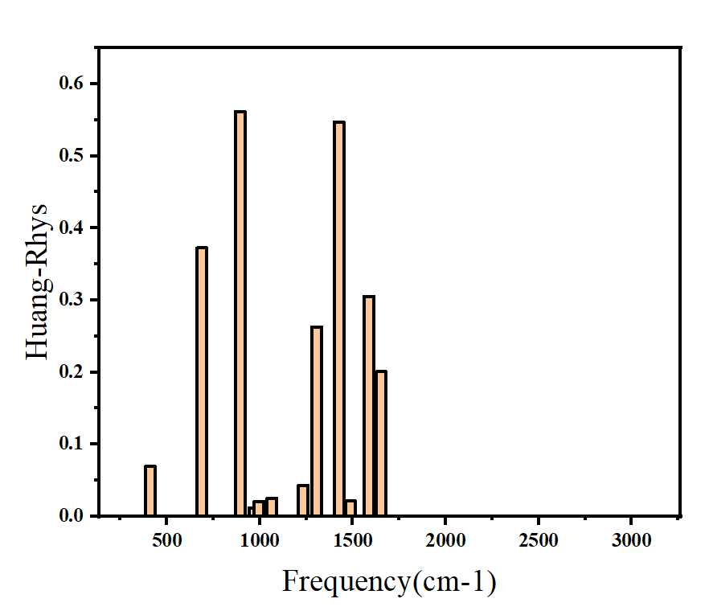
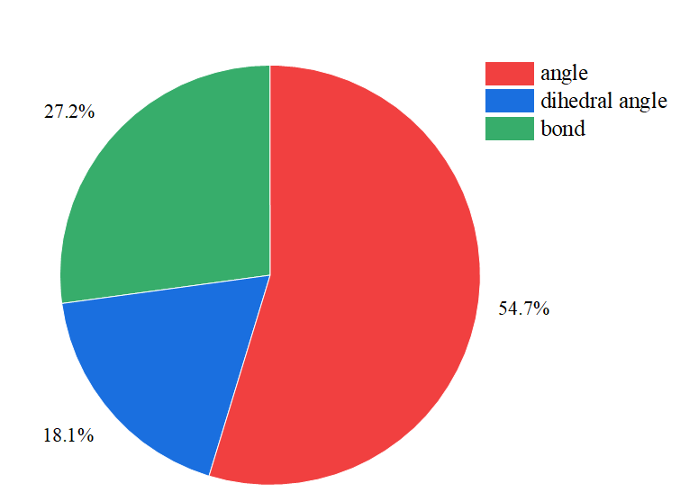

# Internal Coordinate Contribution to Reorganization Energy

## 简介

本程序用于分析Gaussian计算结果，将**重组能分解到冗余内坐标**，揭示不同结构变化（键长、键角、二面角）对重组能的贡献。

计算化学公社的介绍贴：[利用Gaussian分解键长/键角/二面角对重组能的贡献](http://bbs.keinsci.com/forum.php?mod=viewthread&tid=57134&fromuid=63020)

---

## 原理

### 1. 重组能的定义

在电子转移或激发态过程中，重组能 $\lambda$ 描述了核坐标弛豫所需的能量。在简正坐标表示下：

$$\lambda = \sum_{i=1}^{3N-6} S_i \hbar \omega_i$$

其中：
- $S_i$：第 $i$ 个振动模式的Huang-Rhys因子
- $\omega_i$：第 $i$ 个振动模式的频率
- $\hbar$：约化普朗克常数

Huang-Rhys因子表示该模式的位移程度：

$$S_i = \frac{1}{2} \omega_i \Delta Q_i^2$$

其中 $\Delta Q_i$ 是该简正坐标在两个电子态之间的位移。

### 2. 简正模式的内坐标分解

每个简正模式 $Q_i$ 可以表示为内坐标 $\{q_\alpha\}$（键长、键角、二面角等）的线性组合：

$$Q_i = \sum_{\alpha} L_{i\alpha} q_\alpha$$

其中 $L_{i\alpha}$ 是模式 $i$ 在内坐标 $\alpha$ 上的投影系数。

在Gaussian的 `freq=intmodes` 计算中，输出的**相对权重** $w_{i\alpha}$ 反映了内坐标 $q_\alpha$ 在模式 $i$ 中的贡献比例：

$$w_{i\alpha} = \frac{L_{i\alpha}^2}{\sum_{\beta} L_{i\beta}^2} \times 100\%$$

### 3. 内坐标对重组能的贡献

定义内坐标 $q_\alpha$ 对总重组能的贡献为：

$$\lambda_\alpha = \sum_{i=1}^{3N-6} c_{i\alpha} \cdot \lambda_i$$

其中：
- $c_{i\alpha} = w_{i\alpha}/100$：内坐标 $\alpha$ 在模式 $i$ 中的权重（小数形式）
- $\lambda_i = S_i \hbar\omega_i$：模式 $i$ 的重组能贡献

**归一化为百分比**：

$$\text{Contribution}_\alpha = \frac{\lambda_\alpha}{\lambda_{\text{total}}} \times 100\char`\% = \frac{\sum_i c_{i\alpha} \lambda_i}{\sum_i \lambda_i} \times 100\char`\%$$

这样可以定量回答："键长变化贡献了多少重组能？键角变化贡献了多少？"

---

## 使用方法

### 1. 编译程序
本程序没有外部依赖，使用C++11标准，可以直接编译。
```bash
g++ -o intmode intmode.cpp
```
也可以笔者提供的使用预编译版。

### 2. Gaussian计算

输入文件类似于：

```
%oldchk=opt_Azulene.chk
#p geom=allcheck freq(readfc,fcht,readfcht,intmode) IOp(7/75=-1)

initial=source=chk final=source=chk spectroscopy=onephotonemission print=(huangrhys,matrix=JK)

td_Azulene.chk
opt_Azulene.chk
```

主要关键词：
- `freq=intmode IOp(7/75=-1)`: 打印冗余内坐标对振动模式的贡献
- `print=huangrhys`：在FCHT计算中打印huang-rhys因子

### 3. 运行程序

Gaussian计算完毕后，直接运行

```bash
./intmode huang-rhys.log
```

将打印所有冗余内坐标的贡献:

```
====================================================================================================
Internal Coordinate Contribution to Reorganization Energy
====================================================================================================

Detailed Contributions by Coordinate Type:
----------------------------------------------------------------------------------------------------

R (Bond Lengths/Angles/Dihedrals):
   Coord          DefinitionContribution(%)
---------------------------------------------
     R12              R(6,7)         2.9900
      R6              R(3,5)         2.9900
     R11             R(5,13)         2.9407
....


A (Bond Lengths/Angles/Dihedrals):
   Coord          DefinitionContribution(%)
---------------------------------------------
     A12           A(6,4,11)         3.3113
      A6            A(3,2,9)         3.3041
     A11           A(1,4,11)         3.2275
....


D (Bond Lengths/Angles/Dihedrals):
   Coord          DefinitionContribution(%)
---------------------------------------------
     D19         D(11,4,6,7)         0.9518
     D11          D(9,2,3,5)         0.9518
      D8         D(8,1,4,11)         0.8774
....

```

以及统计信息：

```
====================================================================================================
Summary: Total Contribution by Coordinate Type
====================================================================================================

     Coordinate Type        Total %              Description
------------------------------------------------------------
    R (Bond Lengths)          33.62%
     A (Bond Angles)          58.93%
 D (Dihedral Angles)           7.24%
============================================================

Total (should be ~100%): 99.79%

Internal coordinate contributions saved to: intmode.dat
Reorganization energy data saved to: lambda.dat
```

#### 输出文件

程序生成两个数据文件：

`lambda.dat`包含每个振动模式的：
- 频率 (cm⁻¹)
- Huang-Rhys因子
- 重组能贡献 (cm⁻¹)
- 对总重组能的百分比贡献

该文件可以用于绘制论文中常见的柱形图：



`intmode.dat`包含每个内坐标的：
- 坐标名称（如R1, A5, D3）
- 坐标定义（如R(1,2), A(2,1,3)）
- 对总重组能的贡献百分比
- 按类型（R/A/D）分组的汇总统计

论文里常以饼状图呈现：



---

## About
Author: Bane Dysta

you can cite: 
Chiyuan Wei, intmode, Version 1.0, https://github.com/bane-dysta/intmode (accessed on 日 月 年)
